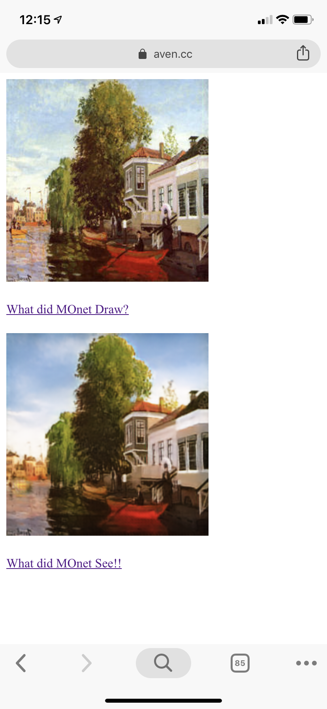

> What did Claude Monet see as he placed his easel by the bank of the Seine near Argenteuil on a lovely spring day in 1873? A color photograph, had it been invented, may have documented a crisp blue sky and a glassy river reflecting it. Monet conveyed his impression of this same scene through wispy brush strokes and a bright palette. **-- Junyan Zhu .etc**

This short paragraph is quoted from the paper written by Junyan Zhu .etc. At the beginning of their paper, they raised this question along with another: 

> What if Monet had happened upon the little harbor in Cassis on a cool summer evening? A brief stroll through a gallery of Monet paintings makes it possible to imagine how he would have rendered the scene: perhaps in pastel shades, with abrupt dabs of paint, and a somewhat flattened dynamic range.

To a very personal point of view, the first question is more interesting since there are already techniques like style transfer which can convert image to certain painting style but not the other way around. Don't get me wrong on this, cycleGAN has great advantages over Fast Style Transfer regards of artistic style transfer since it's the starting point of trying to simulate the artist's style rather than certain painting. Which has also been mentioned in Junyan Zhu's paper:

> Note that unlike recent work on “neural style transfer”, our method learns to mimic the style of an entire collection of artworks, rather than transferring the style of a single selected piece of art. Therefore, we can learn to generate photos in the style of, e.g., Van Gogh, rather than just in the style of Starry Night.

In case you are not that familiar with cycleGAN, you can either go to their project page for more info or go through the solution they have as stated below;

> We can imagine all this despite never having seen a side by side example of a Monet painting next to a photo of the scene he painted. Instead, we have knowledge of the set of Monet paintings and of the set of landscape photographs.

> We can reason about the stylistic differences between these two sets, and thereby imagine what a scene might look like if we were to “translate” it from one set into the other.

There won't be many technical details involved here, we made a tutorial on how to train, convert and inference your own cycleGAN tensorflow.js model in this [repo](https://github.com/aaaven/cyclegan_tfjs). I took the tf.js model from the said project and made this web app. It aims to show you what was in Monet's eye by the day, the moment he was picturing his gorgeous painting. When to click "what did Monet draw?" button, the app will switch between Monet's paintings and display in the first row. Meanwhile, through clicking on "what did Monet see?", participants are able to generate a realistic photo with the same content, like reverse engineering of painting.

Looping back the question raised up at the beginning. CycleGAN was so exciting, it can not only apply the artist's style to given images but also bring us back to the historical moment when the great painting happens and show us what did Monet see!

Here are some screenshots of the web app:

|   |   |   |
|:-:|:-:|:-:|
||||
||||
||||
||||
